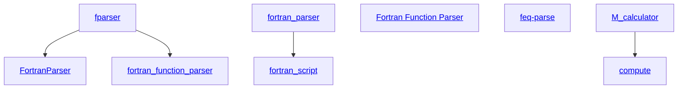

============

### Status

[](https://github.com/jacobwilliams/fortran_function_parser/releases/latest)
[](https://github.com/jacobwilliams/fortran_function_parser/actions)
[](https://codecov.io/gh/jacobwilliams/fortran_function_parser)
[](https://github.com/jacobwilliams/fortran_function_parser/commits/master)

### Description

This function parser module is intended for applications where a set of
mathematical fortran-style expressions is specified at runtime and is
then evaluated for a large number of variable values. This is done by
compiling the set of function strings into byte code, which is
interpreted efficiently for the various variable values.

This code is a modernized version of [fparser](http://fparser.sourceforge.net) (v1.1), a Fortran 95 function parser (v1.1) by [Roland Schmehl](roland.schmehl@alumni.uni-karlsruhe.de). The function parser concept is based on a C++ class library written by Juha Nieminen <warp@iki.fi> available from [here](http://warp.povusers.org/FunctionParser/). The original code has been updated to Fortran 2008 by Jacob Williams. Development continues on [GitHub](https://github.com/jacobwilliams/fortran_function_parser).

### Building

The library can be built with the [Fortran Package Manager](https://github.com/fortran-lang/fpm) using the provided `fpm.toml` file like so:

```bash
fpm build --release
```

By default, the library is built with double precision (`real64`) real values. Explicitly specifying the real kind can be done using the following preprocessor flags:

Preprocessor flag | Kind  | Number of bytes
----------------- | ----- | ---------------
`REAL32`  | `real(kind=real32)`  | 4
`REAL64`  | `real(kind=real64)`  | 8
`REAL128` | `real(kind=real128)` | 16

For example, to build a single precision version of the library, use:

```
fpm build --profile release --flag "-DREAL32"
```

To use `fortran_function_parser` within your fpm project, add the following to your `fpm.toml` file:

```toml
[dependencies]
fortran_function_parser = { git="https://github.com/jacobwilliams/fortran_function_parser.git" }
```

Or, to use a specific version:

```toml
[dependencies]
fortran_function_parser = { git="https://github.com/jacobwilliams/fortran_function_parser.git", tag = "1.1.0" }
```

### Documentation

The latest API documentation can be found [here](https://jacobwilliams.github.io/fortran_function_parser/). This was generated from the source code using [FORD](https://github.com/Fortran-FOSS-Programmers/ford).

### Basic usage

#### Module Import

In all program units where you want to use the function parser
you must import the module by:

```fortran
use function_parser
```

This command imports only 3 public types: `fparser`, `fparser_array`, and
`list_of_errors`, which are explained in the following. The remainder of the
module is hidden to the calling program.

#### Function parsing

A single function string `funcstr` can be parsed (checked and compiled) into
bytecode by calling the `fparser` class method subroutine `parse`:

```fortran
call me%parse(funcstr, var, case_sensitive)
```

The variable names as they appear in the string `funcstr` have to be passed
in the one-dimensional string array `var` (zero size of `var` is acceptable).
The number of variables is implicitly passed by the dimension of this array.
For some notes on the syntax of the function string see below.

To parse an array of function strings, you can use the `fparser_array` class
method `parse` in a similar manner.

#### Function evaluation

The function value is evaluated for a specific set of variable values
by calling the `fparser` class method subroutine `evaluate`:

```fortran
call me%evaluate(val, res)
```

The variable values are passed in the one-dimensional array `val` which must
have the same dimension as array `var`.

To evaluate an array of function strings, you can use the `fparser_array` class
method `evaluate` in a similar manner.

#### Cleanup

To free the memory and destroy a variable of type `fparser` or `fparser_array`,
use the `destroy` method:

```fortran
call me%destroy()
```

### Error handling

Errors can be reported by both the `parse` and `evaluate`
class methods. To check for errors, use the `error` method, and to print them use the `print_errors` method:

```fortran
 if (me%error()) then
     me%print_errors(output_unit)
 end if
```

An error in the function parsing step leads to a detailed error message
(type and position of error). An error during function evaluation returns a function value of 0.0.

### Function string syntax

Although they have to be passed as array elements of the same declared
length (Fortran restriction), the variable names can be of arbitrary
actual length for the parser. By default, parsing for variables is case insensitive,
but case sensitive evaluation is also an option.

The syntax of the function string is similar to the Fortran convention.
Mathematical Operators recognized are `+,` `-,` `*,` `/,` `**` or alternatively `^,`
whereas symbols for brackets must be `()`.

The function parser recognizes the (single argument) Fortran intrinsic
functions:
* [`abs`](https://fortran-lang.org/learn/intrinsics/ABS), [`acos`](https://fortran-lang.org/learn/intrinsics/ACOS), [`asin`](https://fortran-lang.org/learn/intrinsics/ASIN), [`atan`](https://fortran-lang.org/learn/intrinsics/ATAN), [`atan2`](https://fortran-lang.org/learn/intrinsics/ATAN2), [`ceiling`](https://fortran-lang.org/learn/intrinsics/CEILING), [`cos`](https://fortran-lang.org/learn/intrinsics/COS), [`cosh`](https://fortran-lang.org/learn/intrinsics/COSH), [`exp`](https://fortran-lang.org/learn/intrinsics/EXP), [`floor`](https://fortran-lang.org/learn/intrinsics/FLOOR), [`gamma`](https://fortran-lang.org/learn/intrinsics/GAMMA), [`hypot`](https://fortran-lang.org/learn/intrinsics/HYPOT), [`log`](https://fortran-lang.org/learn/intrinsics/LOG), [`log10`](https://fortran-lang.org/learn/intrinsics/LOG10), [`max`](https://fortran-lang.org/learn/intrinsics/MAX), [`min`](https://fortran-lang.org/learn/intrinsics/MIN), [`mod`](https://fortran-lang.org/learn/intrinsics/MOD), [`modulo`](https://fortran-lang.org/learn/intrinsics/MODULO), [`sign`](https://fortran-lang.org/learn/intrinsics/SIGN), [`sin`](https://fortran-lang.org/learn/intrinsics/SIN), [`sinh`](https://fortran-lang.org/learn/intrinsics/SINH), [`sqrt`](https://fortran-lang.org/learn/intrinsics/SQRT), [`tan`](https://fortran-lang.org/learn/intrinsics/TAN), [`tanh`](https://fortran-lang.org/learn/intrinsics/TANH)

In addition, the following zero-argument function:
* `pi` -- Returns the value of $\pi$

And the three-argument function:
* `if` -- Logical comparision function. The syntax is: `if(expression, value if true, value if false)`, where 0.0 is false, and any other real value is true.

Parsing for functions is always case INsensitive.

Operations are evaluated in the correct order:

* `()      `    expressions in brackets first
* `-A      `    unary minus (or plus)
* `A**B A^B`    exponentiation (`A` raised to the power `B`)
* `A*B  A/B`    multiplication and division
* `A+B  A-B`    addition and subtraction

The function string can contain integer or real constants. To be recognized
as explicit constants these must conform to the format

`[+|-][nnn][.nnn][e|E|d|D[+|-]nnn]`

where `nnn` means any number of digits. The mantissa must contain at least
one digit before or following an optional decimal point. Valid exponent
identifiers are 'e', 'E', 'd' or 'D'. If they appear they must be followed
by a valid exponent.

### Other codes

There are various other expression parsers out there written in Fortran:



* [fparser](http://fparser.sourceforge.net) -- Original Fortran 95 function parser by Roland Schmehl.
* [FortranParser](https://github.com/jacopo-chevallard/FortranParser) -- Another refactoring of the original `fparser` code by Jacopo Chevallard.
* [Fortran Function Parser](http://www.labfit.net/functionparser.htm) -- An entirely different code by Wilton and Ivomar, 10/01/2007 (GitHub mirror [here](https://github.com/jacobwilliams/ffp)).
* [feq-parse](https://github.com/FluidNumerics/feq-parse) -- Fortran Equation Parser from FluidNumerics.
* [fortran_parser](https://github.com/sdm900/fortran_parser) -- Fortran Equation Parser from Stuart Midgley.
* [M_calculator](https://github.com/urbanjost/M_calculator) -- Parse Fortran-like double precision scalar expressions from urbanjost

### See also

* [Application of Modern Fortran to Spacecraft Trajectory Design and Optimization](https://ntrs.nasa.gov/api/citations/20180000413/downloads/20180000413.pdf) (AIAA 2018-1451) describes a method of constructing a Fortran expression parser using binary syntax trees.
* [Dynamic Eval for Fortran](https://github.com/j3-fortran/fortran_proposals/issues/126) Suggestion to add dynamic expression evaluation to the Fortran language (don't hold your breath).